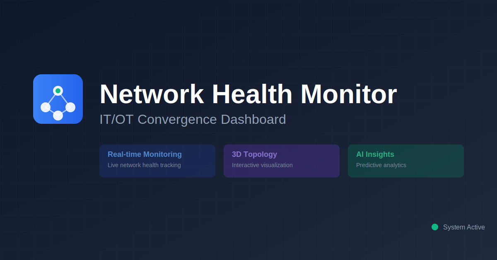
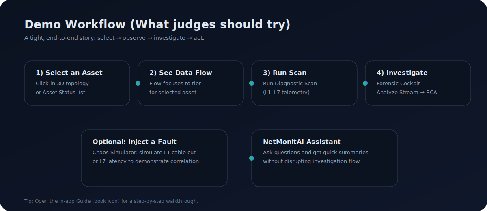
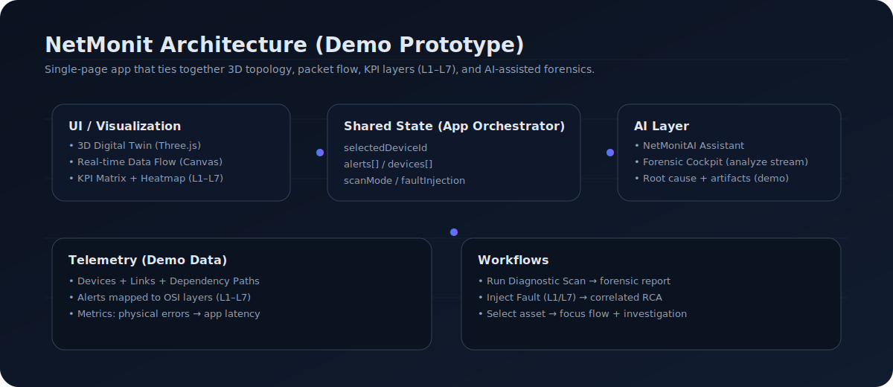

# NetMonit — AI‑Assisted Network Health Monitor (IT/OT)

<p align="center">
	
</p>

<p align="center">
	<strong>Real-time visibility + AI-assisted forensics across OSI Layers L1–L7 for Smart Industry networks.</strong>
</p>

<p align="center">
	<a href="#quickstart">Quickstart</a> ·
	<a href="#demo-script-90-seconds">Demo Script</a> ·
	<a href="#key-features">Key Features</a> ·
	<a href="#architecture">Architecture</a>
</p>

<p align="center">
	
</p>

---

## What this is

NetMonit is a hackathon-style prototype dashboard for **IT/OT convergence monitoring**.
It ties together a **3D network digital twin**, a **real-time data flow visualization**, **L1–L7 KPIs**, and an **AI-assisted forensic cockpit** so an operator can:

- Spot abnormal conditions quickly
- Understand cross-layer impact (physical → application)
- Run guided investigation (“Analyze Stream”) and get a clear RCA + recommendations

This repo is optimized for a compelling demo and clear narrative (not production telemetry ingestion).

---

## Key features

### L1–L7 visibility
- KPI Matrix and analytics map alerts to **L1, L2, L3, L4, L5, L6, L7**
- Layer-aware RCA: Physical faults don’t automatically become “cable cut” unless severe (prevents false “catastrophic” startup)

### 3D topology digital twin
- Interactive 3D selection (raycast pick)
- Selection becomes shared context (e.g., data-flow focus)

### Real-time data flow (demo)
- Live packet-flow animation
- When you select an asset, the flow **focuses** to its tier to make the linkage obvious

### Forensic cockpit (deep investigation)
- “Analyze Stream” generates a forensic report (summary, RCA, recommended actions)
- Terminal panel supports regex filtering (e.g. `error|refused|fail`) and never renders as an empty blank state

### NetMonitAI assistant (optional)
- A separate, user-invoked AI assistant for conversational help and quick summaries
- Designed not to interrupt the forensic workflow

---

## Demo script (90 seconds)

<p>
	
</p>

1. Click the **Guide** (book icon, top-right) and follow the highlights
2. In **3D Topology**, click a device to select it
3. Observe **Real-Time Data Flow** focusing to that asset’s tier
4. Click **Run Diagnostic Scan** to trigger L1–L7 scan mode + forensics
5. Open **Forensic Cockpit** → pick an alert → **Analyze Stream**
6. (Optional) Use **Chaos Simulator** to inject an L1 or L7 fault and re-run analysis

---

## Architecture

<p>
	
</p>

**Core idea:** one shared state (“selected asset”, “alerts”, “scan mode”) drives all panels so the demo feels connected.

- UI: React + TypeScript + Vite
- 3D: Three.js (digital twin)
- Data flow: Canvas animation
- Forensics + AI simulation: deterministic demo logic producing reports + artifacts

---

## Quickstart

### Prerequisites
- Node.js 18+ recommended

### Install
```bash
npm install
```

### Run
```bash
npm run dev
```

Open the URL shown in your terminal (typically `http://localhost:5173`).

### Build
```bash
npm run build
```

---

## Where things live

- `src/App.tsx` — app orchestration + shared state
- `src/components/Advanced3DTopology.tsx` — 3D topology + selection
- `src/components/DataFlowVisualization.tsx` — data flow + scan mode + chaos controls
- `src/components/KPIMatrix.tsx` — L1–L7 KPI breakdown
- `src/components/forensics/unified/UnifiedForensicView.tsx` — forensic cockpit
- `src/components/AICopilot.tsx` — NetMonitAI assistant
- `src/utils/aiLogic.ts` — demo AI/forensic report logic
- `src/data/mockData.ts` — devices, alerts, links, dependency paths

---

## Troubleshooting

- If the dev server port is busy, run: `npm run dev -- --port 5174`
- If you see “0 matches” in the forensic terminal filter, it means the regex didn’t match current log lines; clear the filter to view full output.

---


